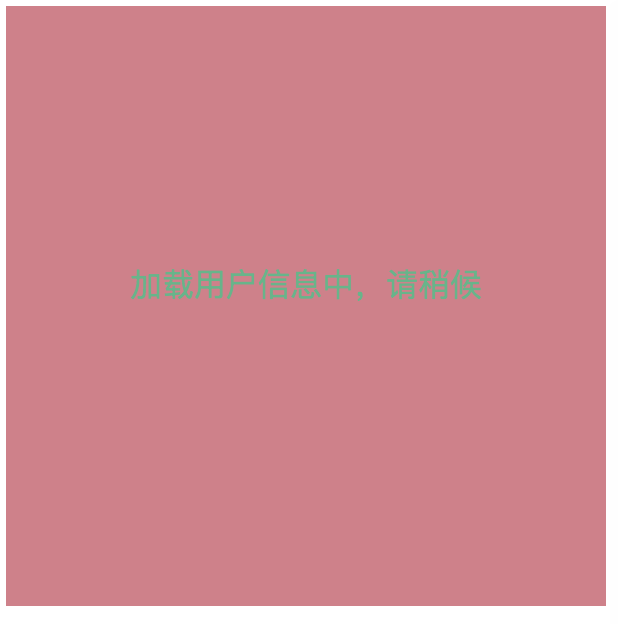

# JQ封装的遮罩层插件

调用方法如下

```javascript
$("#box").covering({
	 //覆盖遮罩的文本信息可设置
    coveringText : "加载用户信息中，请稍候",
    //是否隐藏被覆盖的元素可设置，false不隐藏，true隐藏
    coveringHide:false,
    //遮罩层的透明度可设置
    opacity: 0.4,
    //遮罩层的背景颜色可设置，支持rgb,十六进制颜色值及英文
    bgColor: "red",
    //字体颜色可设置
    fontColor: "green",
    //回调函数可设置，若传入的不是一个函数，不报错，错误信息存储在控制台
    onLoadSuccess:function () {
        console.log(1);
    }});
//可二次更改遮罩层的文本信息
$("#box").covering("setCoveringText","系统错误，请与管理员联系");
//可将遮罩层进行隐藏移除
$("#box").covering("hide");
```

> 注意：本方法是拓展一个对象到jQuery的prototype中，要使用需引入JQ

html结构如下

```html
<head>
    <meta charset="UTF-8">
    <title>Title</title>
    <script src="js/jquery-1.9.1.js"></script>
    <script src="js/covering.js"></script>
    <style>
        #box{
            width: 300px;
            height: 300px;
            background-color: lightblue;
        }
    </style>
</head>
<body>
    <div id="box"></div>
</body>
```

效果图如下<br>

